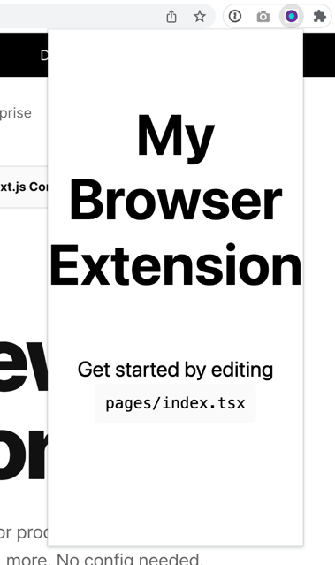

# Browser extension for Chrome and Firefox built in Next.js/React

Inspired by:

- [Using Next.js to create a browser extension (Chrome & Firefox)](https://dev.to/alexbh/using-next-js-to-create-a-browser-extension-chrome-firefox-490h)
- [Creating a Chrome extension with React and TypeScript](https://blog.logrocket.com/creating-chrome-extension-react-typescript/)

## How to use

1. Run `yarn build-extension`. This exports the site to `./out` and builds an `./extension/myExtension.zip` bundle.
2. To add your extension in Chrome, open the URL chrome://extensions/ then click “Load unpacked” and select the `./out` folder.
3. To run your extension, click the Extensions icon (🧩) in the Chrome toolbar and click on your extension.

